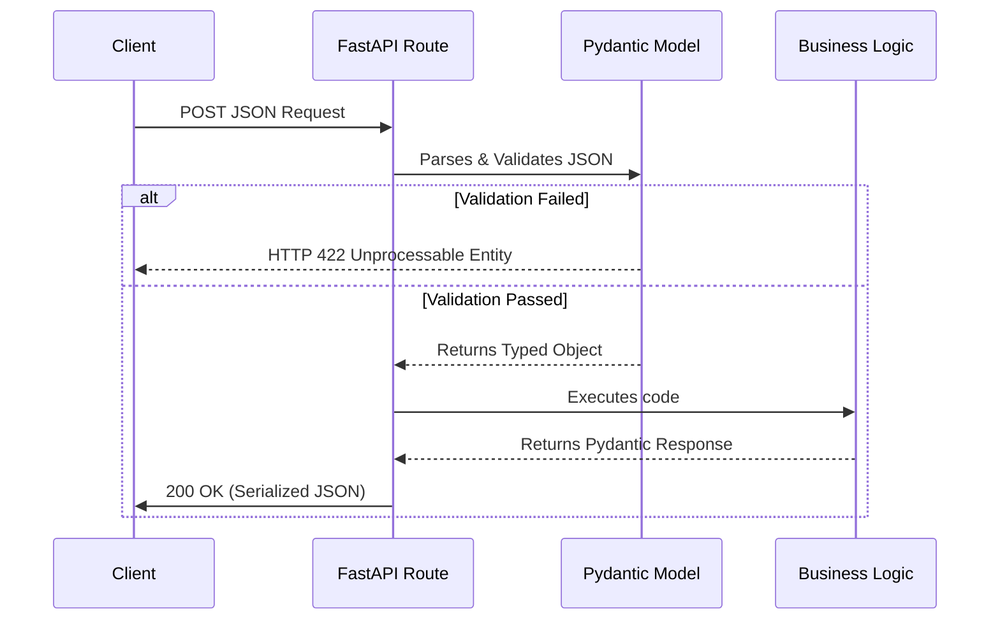

# 📦 Chapter 2: Pydantic

*Mastering Pydantic.*
The foundation of the entire Python AI/API stack. Learn how to validate data effortlessly.
**Estimated Reading Time:** 20 min

---

Pydantic is the foundation of the entire Python AI/API stack. FastAPI, LangGraph, and LangFuse all use it internally. Before you can write a FastAPI route, you need to understand Pydantic models. 

---

## 1. What is Pydantic?

In Java, if you want to receive JSON, validate it, and turn it into an object, you combine several tools: a POJO/DTO class, Jackson (for JSON mapping), and Hibernate Validator / Bean Validation (for constraints). 

**Pydantic does all of this in a single class.**

!!! note "The Spring Boot Equivalent"
    Pydantic = `@Entity` + `@Valid` + Bean Validation + Jackson ObjectMapper — all in one class. No boilerplate, no getters/setters, no Lombok required.

When you create an instance of a Pydantic model (`BaseModel`), it automatically validates all fields, converts types where possible, and raises a detailed error if validation fails. 

---

## 2. Creating Models

In Spring, you write DTOs using standard classes and private fields. In Pydantic, you inherit from `BaseModel` and use Python type hints.

**Spring Boot (Java)**
```java
class StudentDTO {
    private String name;
    private int age;
    
    // + Getters, Setters, or Lombok @Data
}
```

**Python (Pydantic)**
```python
from pydantic import BaseModel

class Student(BaseModel):
    name: str
    age: int
```

Notice how much cleaner it is. There are no private fields, no accessors, and no constructors. You instantiate it using keyword arguments: `Student(name="Alice", age=22)`.

---

## 3. Field Validation

In Spring, you annotate fields with `@NotNull`, `@Size`, or `@Email`. In Pydantic, you use the `Field()` function and special types like `EmailStr`.

| Spring Boot Bean Validation | Pydantic Equivalent |
|---|---|
| `@NotNull` | `Field(...)` (required by default) |
| `@Size(min=3, max=20)` | `Field(min_length=3, max_length=20)` |
| `@Min(0) @Max(100)` | `Field(ge=0, le=100)` |
| `@Email` | `EmailStr` (requires `pip install pydantic[email]`) |

**Example:**
```python
from pydantic import BaseModel, Field, EmailStr

class UserRegistration(BaseModel):
    username: str = Field(min_length=3, max_length=20)
    email: EmailStr
    age: int = Field(ge=18, description="Must be an adult")
```

---

## 4. Nested Models & Collections

Nested objects and collections map cleanly from Java to Python. 

**Spring Boot:**
```java
class StudentDTO {
    private AddressDTO address;
    private List<String> courses;
    private Optional<String> bio;
}
```

**Python:**
```python
from pydantic import BaseModel

class Address(BaseModel):
    city: str
    zip_code: str

class Student(BaseModel):
    address: Address              # Nested Model
    courses: list[str]            # Collection
    bio: str | None = None        # Optional (or Optional[str] = None)
    metadata: dict[str, str] = {} # Map
```

Validation applies recursively. If `zip_code` is missing from the nested `Address` JSON, the entire `Student` validation fails with a precise error path (`address -> zip_code`).

---

## 5. Custom Validators

For complex validation that `Field()` can't handle, use `@field_validator` (equivalent to a custom `@Constraint` in Java). 

```python
from pydantic import BaseModel, field_validator, model_validator

class Product(BaseModel):
    price: float
    discount: float = 0.0

    # 1. Validate a single field
    @field_validator("price")
    @classmethod
    def price_must_be_positive(cls, v: float) -> float:
        if v <= 0:
            raise ValueError("Price must be > 0")
        return v

    # 2. Validate multiple fields together
    @model_validator(mode="after")
    def check_discount(self) -> "Product":
        if self.discount >= self.price:
            raise ValueError("Discount cannot exceed price")
        return self
```

!!! tip "Pre-Validation (`mode="before"`)"
    If you need to intercept raw JSON strings *before* Pydantic tries to cast them (e.g., intercepting `"$19.99"` before it fails the `float` cast), use `@field_validator("price", mode="before")`.

---

## 6. Serialization & JSON Mapping

Pydantic handles JSON mapping seamlessly, replacing the need for Jackson's `@JsonProperty` and `ObjectMapper`.

| Spring Boot (Jackson) | Pydantic Equivalent |
|---|---|
| `objectMapper.writeValueAsString()` | `model.model_dump_json()` |
| `objectMapper.convertValue(obj, Map.class)` | `model.model_dump()` |
| `@JsonProperty("first_name")` | `Field(alias="first_name")` |
| `@JsonIgnore` | `Field(exclude=True)` |

If your Python code uses `snake_case` but your API clients expect `camelCase`, Pydantic can automate the conversion:

```python
from pydantic import BaseModel, ConfigDict
from pydantic.alias_generators import to_camel

class UserProfile(BaseModel):
    # Automatically maps JSON {"firstName": "Alice"} to self.first_name
    model_config = ConfigDict(alias_generator=to_camel, populate_by_name=True)
    
    first_name: str
```

---

## 7. Enums & Literal

To constrain a string to a specific set of allowed values, you have two options.

**1. Enum (Standard)**
```python
from enum import Enum
from pydantic import BaseModel

class Status(str, Enum):
    PENDING = "pending"
    APPROVED = "approved"

class Task(BaseModel):
    status: Status
```

**2. Literal (Quick & Pythonic)**
If you don't want to create a full Enum class, you can use `Literal` directly in the type hint.
```python
from typing import Literal
from pydantic import BaseModel

class Task(BaseModel):
    status: Literal["pending", "approved", "rejected"]
```

---

## 8. BaseSettings

Spring Boot relies heavily on `@ConfigurationProperties` to map `application.yml` files into type-safe Java beans. Pydantic provides `BaseSettings` for exactly this purpose.

It automatically reads from environment variables and `.env` files, performing strict validation on startup.

```python
# pip install pydantic-settings
from pydantic_settings import BaseSettings, SettingsConfigDict

class AppConfig(BaseSettings):
    database_url: str
    api_key: str
    debug_mode: bool = False  # Automatically parses "true" or "1" from env
    
    # Read from a local .env file
    model_config = SettingsConfigDict(env_file=".env")

# Instant runtime validation of your environment!
config = AppConfig() 
```

---

## 9. Pydantic v1 vs v2

If you are copying code from StackOverflow or older tutorials, be highly aware of the version. Pydantic v2 was a massive rewrite in Rust, changing several core methods.

Always use modern v2 syntax:

| Pydantic v1 (Old) | Pydantic v2 (Modern) |
|---|---|
| `@validator` | `@field_validator` |
| `model.dict()` | `model.model_dump()` |
| `model.json()` | `model.model_dump_json()` |

---

## 10. FastAPI Integration

The true power of Pydantic is how deeply it integrates with FastAPI. When you use a Pydantic model in a FastAPI route, the entire request lifecycle is handled for you automatically.



You never write parsing or validation code inside your controllers. If the JSON is bad, FastAPI rejects it before your code even executes.

---

## 11. Spring Boot Comparison Summary

Here is the final cheat sheet for mapping your Java mental models to Python.

| Concept | Spring Boot | Pydantic |
|---|---|---|
| **Data Models** | Passive DTOs | Self-validating `BaseModel` |
| **Validation** | Bean Validation annotations | Python type hints + `Field()` |
| **JSON Mapping** | Jackson `ObjectMapper` | Built-in JSON serialization |
| **Type Safety** | Compile-time typing | Runtime validation |
| **Boilerplate** | Lombok `@Data` / getters | None (uses Keyword arguments) |
| **Architecture** | Reflection-heavy | Type-hint driven |
| **Configuration** | `@ConfigurationProperties` | `BaseSettings` |

---

## 12. Best Practices

To write clean, maintainable AI applications:

1. **Separate Request and Response Models:** Do not reuse `UserCreateRequest` for `UserResponse`. They have different validation rules (e.g., passwords exist in requests, but not in responses).
2. **Prefer Validation over Manual Checks:** Never write `if age < 18:` in your FastAPI route. Push that logic into a Pydantic `@field_validator` so it is enforced globally.
3. **Keep Models Focused:** A Pydantic model should only validate data structure and constraints. Do not put database calls or complex business logic inside `@model_validator`. 
