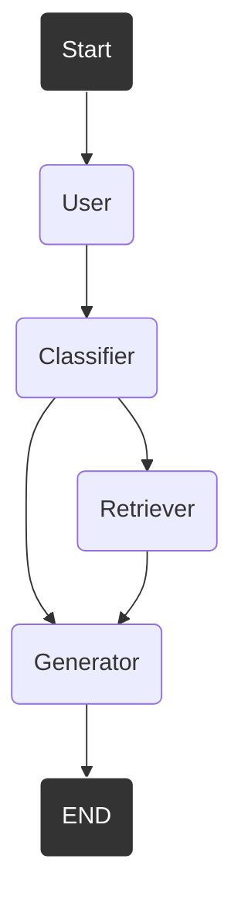
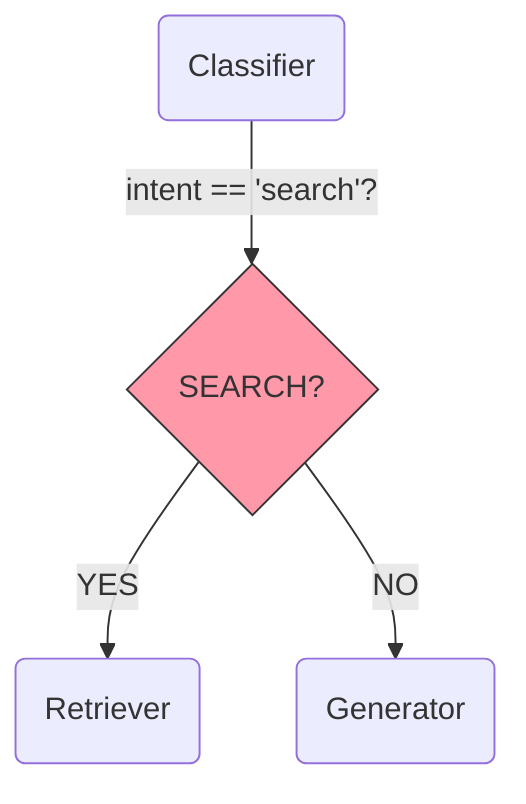
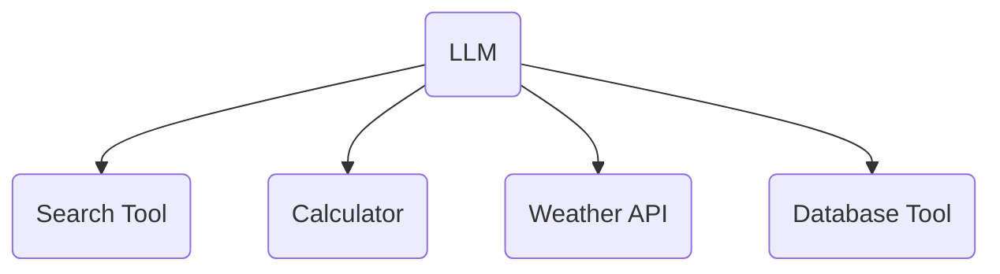
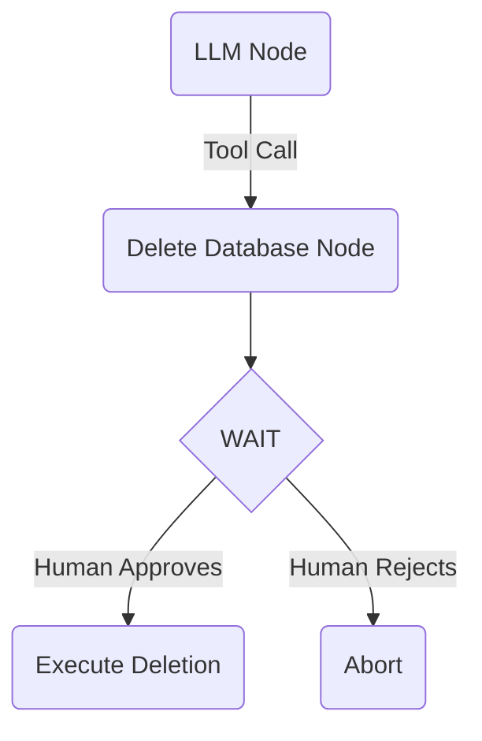
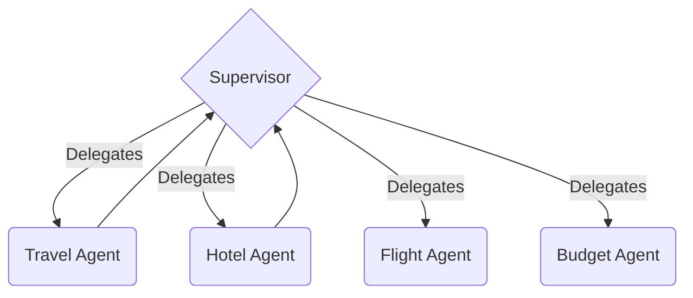
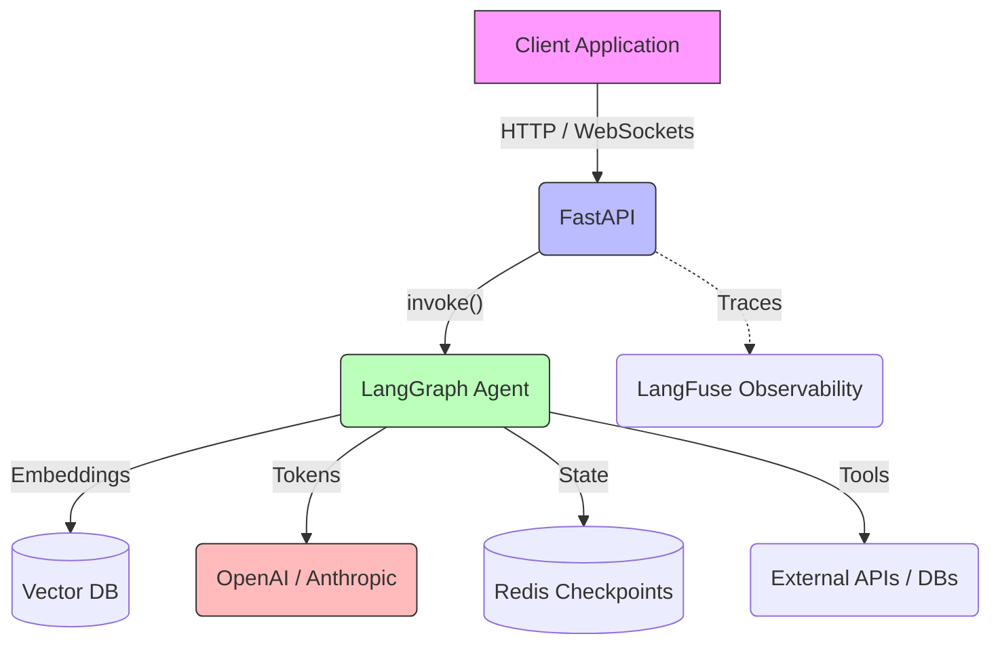

# 🤖 Chapter 4: LangGraph

*Mastering LangGraph.*
Model your AI application as an explicit state machine for complex workflows and multi-agent coordination.
**Estimated Reading Time:** 35 min

---

If your audience is specifically Spring Boot developers, comparing every LangGraph concept to a core Spring Boot feature isn't always natural. The true equivalent in the Java ecosystem is **Spring AI**.

This chapter explains how to build production AI applications in Python, using LangGraph, while drawing direct comparisons to Spring AI where they make sense—and explaining entirely new paradigms where they don't.

---

## 1. Why LangGraph?

!!! note "Spring AI Comparison"
    Spring AI provides `ChatClient`, `ChatMemory`, RAG support, and tool calling. LangGraph builds on similar foundational concepts, but its core philosophy is fundamentally different. Instead of simple linear method calls, LangGraph forces you to model your AI application as an explicit **state machine** (a graph). This makes complex workflows with loops, branching, and multi-agent coordination much easier to express and debug.

---

## 2. LangGraph Architecture

At its core, a LangGraph application consists of:

* **StateGraph:** The object that holds everything together (orchestration).
* **State:** A shared dictionary (`TypedDict`) that flows between all nodes.
* **Nodes:** Python functions (Advisors/Components) that read the state and return *partial* updates.
* **Edges:** Wires connecting nodes, dictating workflow transitions.
* **compile() / invoke():** Building the graph into a runnable `Runnable` and executing it.



---

## 3. Building Your First Graph

Nodes are just pure Python functions. Edges define the flow. `add_edge()` is unconditional—it always goes from node A to node B.

```python
def classifier_node(state: AgentState):
    intent = call_llm_to_classify(state["query"])
    return {"intent": intent} # Return partial state update

graph = StateGraph(AgentState)
graph.add_node("classifier", classifier_node)
graph.add_node("retriever", retriever_node)

# Normal Edge: Classifier always goes to Retriever
graph.add_edge("classifier", "retriever")
app = graph.compile()
```

**Visualizing your compiled Graph**

Once you compile your graph, you can instantly visualize the flow using LangGraph's built-in Mermaid renderer. This is incredibly useful for debugging complex edge routing.

```python
print(app.get_graph().draw_mermaid())
```

---

## 4. State Management

This is the heart of LangGraph. State is passed as a read-only parameter, and nodes return a dictionary of *what changed*. 

```python
from typing import TypedDict, Annotated
import operator

class AgentState(TypedDict):
    query: str
    intent: str
    # The 'operator.add' reducer tells LangGraph to APPEND to the list, not overwrite it!
    context: Annotated[list[str], operator.add] 
```

**Reducers (operator.add):** If multiple nodes run in parallel and return messages, or you append to a conversation over time, you must use a **Reducer**. Without `operator.add`, returning `{"context": ["new"]}` would overwrite the entire context history. With `operator.add`, LangGraph concatenates the lists.

---

## 5. Routing & Conditional Flows

This is what makes agents intelligent. Instead of a hardcoded path, a routing function reads the state and decides where to go next.



```python
def route_intent(state: AgentState):
    if state["intent"] == "search":
        return "go_to_retriever"
    return "go_to_generator"

graph.add_conditional_edges(
    "classifier",
    route_intent,
    {
        "go_to_retriever": "retriever",
        "go_to_generator": "generator"
    }
)
```

---

## 6. Tool Calling

!!! note "Spring AI Comparison"
    Spring AI provides Tool Calling via `@Bean` functions and the `@Tool` annotation. LangGraph handles this similarly by binding Python functions via `@tool`, but executes them explicitly within the graph loop using a dedicated `ToolNode`.



```python
from langchain_core.tools import tool
from langgraph.prebuilt import ToolNode

@tool
def calculate(a: int, b: int) -> int:
    '''Adds two numbers.'''
    return a + b

llm_with_tools = llm.bind_tools([calculate])
tool_node = ToolNode(tools=[calculate])
```

---

## 7. Memory

!!! note "Spring AI Comparison"
    Where Spring AI provides `ChatMemory` (like `InMemoryChatMemory`), LangGraph uses `Checkpointers` like `MemorySaver`. LangGraph's approach inherently ties memory to a specific `thread_id` injected at invocation time.

```python
from langgraph.checkpoint.memory import MemorySaver

memory = MemorySaver()
app = graph.compile(checkpointer=memory)

# Execute the graph with session memory
config = {"configurable": {"thread_id": "session-1234"}}
app.invoke({"query": "My name is John"}, config=config)

# Second turn - the graph remembers!
app.invoke({"query": "What is my name?"}, config=config)
```

---

## 8. Streaming

!!! note "Spring AI Comparison"
    Spring AI provides streaming `ChatClient` responses (`Flux<String>`). LangGraph offers `astream()`, allowing you to stream both the raw LLM tokens *and* the internal state updates of the graph as they happen.

```python
async for chunk in app.astream({"query": "Hello"}, stream_mode="updates"):
    for node_name, state_update in chunk.items():
        print(f"Node {node_name} just updated state: {state_update}")
```

---

## 9. Human-in-the-loop

This is a paradigm unique to graph-based orchestration. Enterprise agents often require human approval before taking destructive actions (like dropping a database table). By compiling with an interrupt, the graph pauses execution and serializes its state until a human resumes it.



```python
# Compile the graph with a pause
app = graph.compile(checkpointer=memory, interrupt_before=["execute_deletion"])
app.invoke(state, config=config) # Pauses
# ... User clicks "Approve" in UI ...
app.invoke(None, config=config) # Resumes
```

---

## 10. Multi-Agent Systems

For massive systems, a single graph is too complex. You can build **Hierarchical Graphs** where a Supervisor agent routes tasks to Worker agents (who have their own sub-graphs). This multi-agent coordination is difficult to cleanly model in Spring AI but trivial in LangGraph.



---

## 11. Production Patterns

### End-to-End System Architecture

Where does LangGraph fit in a full Python backend? 



### Validation & Persistence

!!! note "Spring AI Comparison"
    Just like Spring AI uses `Structured Output Converters` to map JSON to Java records, Python uses Pydantic. LangGraph uses `with_structured_output` to force the LLM to return valid Pydantic schemas.

In production, `MemorySaver` is in-memory only. You must use a database to persist LangGraph checkpoints so conversations survive server restarts (`AsyncPostgresSaver`, `RedisSaver`).


### Production Directory Structure

While simple tutorials put everything in a single `graph.py` file, a true production LangGraph application built alongside FastAPI should isolate responsibilities. 

Here is an industry-standard directory structure demonstrating how to break down a massive agentic system:

```text
app/
│
├── api/
│   ├── routes.py
│   └── dependencies.py
│
├── graph/
│   ├── graph.py              # StateGraph definition
│   ├── state.py              # TypedDict / State
│   ├── builder.py            # compile()
│   │
│   ├── nodes/
│   │   ├── classifier.py
│   │   ├── retrieval.py
│   │   ├── generation.py
│   │   ├── summarizer.py
│   │   ├── planner.py
│   │   └── tools.py
│   │
│   ├── routers/
│   │   ├── intent_router.py
│   │   ├── validation_router.py
│   │   └── tool_router.py
│   │
│   ├── prompts/
│   │   ├── classifier.py
│   │   ├── generator.py
│   │   └── planner.py
│   │
│   ├── memory/
│   │   ├── checkpoint.py
│   │   └── redis.py
│   │
│   ├── tools/
│   │   ├── calculator.py
│   │   ├── search.py
│   │   ├── weather.py
│   │   └── database.py
│   │
│   └── schemas/
│       ├── state.py
│       └── outputs.py
│
├── services/
│   ├── embedding_service.py
│   ├── vector_service.py
│   └── llm_service.py
│
├── repositories/
│   ├── vector_repository.py
│   └── user_repository.py
│
├── db/
│
├── config/
│
└── main.py
```
