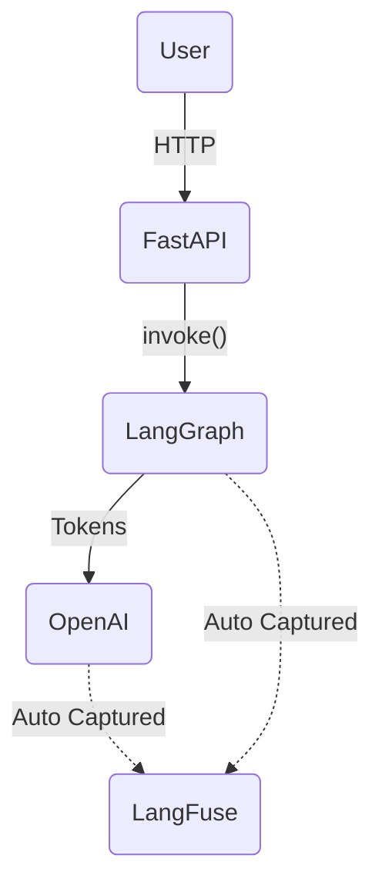
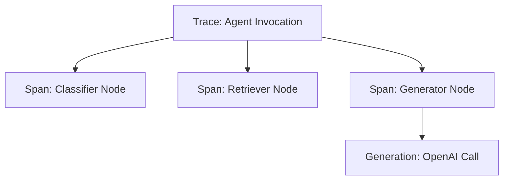
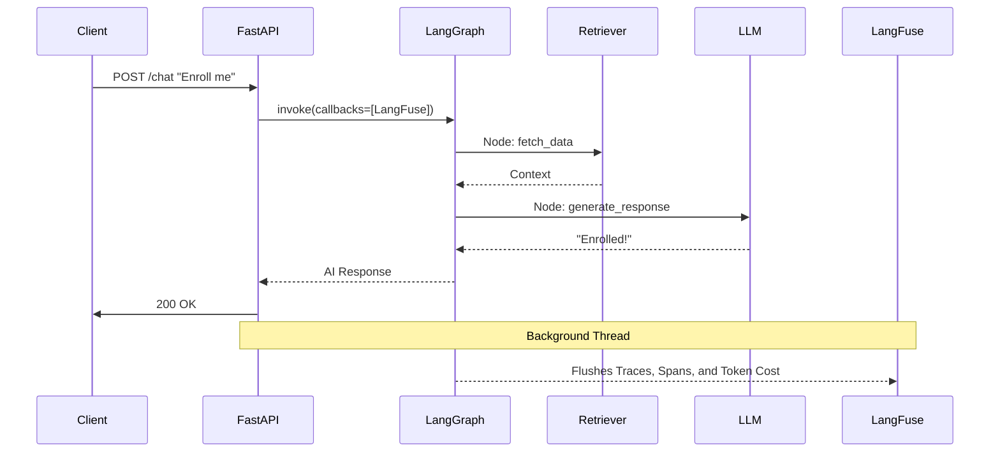

# 📈 Chapter 5: LangFuse

*Observability with LangFuse.*
Trace, monitor, and debug your LLM calls in production.
**Estimated Reading Time:** 15 min

---

If you are a Spring Boot developer, you are already deeply familiar with observability. You would never deploy a production service without Micrometer, Zipkin, and Actuator. 

LangFuse is the exact equivalent of that stack, but purpose-built for the AI ecosystem. 

---

## 1. What is LangFuse?

Standard text logs (like `log4j` or `slf4j`) are practically useless for debugging LLM applications. If an AI agent hallucinates or takes 15 seconds to reply, a flat log file won't tell you *which* internal prompt failed, *how many* tokens were consumed, or *why* the vector database returned bad context.

LangFuse solves this by providing hierarchical tracing, token accounting, and cost tracking.

!!! note "The Spring Observability Map"
    Here is how your existing Java knowledge maps to the AI ecosystem:
    
    | Spring Ecosystem | AI / Python Ecosystem |
    |---|---|
    | `slf4j` / `logback` | Python `logging` (system health only) |
    | Micrometer | LangFuse (Metrics & Token usage) |
    | Zipkin / Jaeger | LangFuse (Distributed Tracing) |
    | Spring Boot Actuator | LangFuse Dashboard |
    | OpenTelemetry | LangFuse + OTel Integration |

---

## 2. Installing & Setting Up LangFuse

Getting started is as simple as installing the SDK and providing your API keys. You can use LangFuse Cloud or self-host it via Docker.

```bash
pip install langfuse
```

In your `.env` file (the equivalent of `application.yml`):
```env
LANGFUSE_PUBLIC_KEY=pk-lf-...
LANGFUSE_SECRET_KEY=sk-lf-...
LANGFUSE_HOST=https://cloud.langfuse.com
```

Initialize the client anywhere in your app:
```python
from langfuse import Langfuse

langfuse = Langfuse() # Automatically picks up the .env variables
```

---

## 3. Your First Trace

To understand LangFuse, you must understand its core hierarchy. It is identical to OpenTelemetry's trace tree.

* **Trace:** The top-level container for a single request (e.g., a user asking a question).
* **Span:** A specific unit of work inside the trace (e.g., querying the database).
* **Generation:** A specialized span specifically for an LLM call. This is the most important object in LangFuse because it automatically records the 7 critical dimensions of every LLM interaction:
    1. **Prompt** (The exact text sent to the LLM)
    2. **Completion** (The exact text returned by the LLM)
    3. **Input Tokens** (How much context was consumed)
    4. **Output Tokens** (How much text was generated)
    5. **Model** (e.g., `gpt-4o-mini`)
    6. **Latency** (How long the model took to reply)
    7. **Cost** (Calculated based on the model and token counts)

```text
Trace (User Request)
    ├── Span (Vector DB Retrieval)
    └── Generation (OpenAI GPT-4 Call)
```

---

## 4. Automatic Tracing

The easiest way to trace is by letting LangFuse do it automatically. If you use FastAPI, LangGraph, and OpenAI, LangFuse can hook into the execution context.



By simply passing the LangFuse `CallbackHandler` into your LangGraph invocation, the entire execution tree is automatically sent to LangFuse.

```python
from langfuse.callback import CallbackHandler

langfuse_handler = CallbackHandler()

# Everything inside this graph execution is automatically traced!
app.invoke(
    {"messages": ["Hello"]}, 
    config={"callbacks": [langfuse_handler]}
)
```

---

## 5. The `@observe` Decorator

!!! note "Spring AI Comparison"
    This is the exact equivalent of Spring's `@Span` or `@Timed` annotations.

The `@observe` decorator is the easiest way to trace custom business logic outside of LangGraph. When you decorate a function, LangFuse automatically creates a span recording its input, output, duration, and any nested child spans.

```python
from langfuse.decorators import observe
from langchain_openai import ChatOpenAI
from langchain_core.messages import HumanMessage

llm = ChatOpenAI(model="gpt-4o-mini")

# Child span — tracked as a sub-operation
@observe()
def generate_summary(text: str) -> str:
    response = llm.invoke([HumanMessage(content=f"Summarize: {text}")])
    return response.content

# Parent span — contains child spans in the trace tree
@observe()
def process_document(doc_id: str, content: str) -> dict:
    summary = generate_summary(content) # Child span auto-created
    return {"summary": summary}
```

---

## 6. FastAPI Middleware Tracing

Just like Spring Interceptors, you can use a FastAPI Middleware to automatically start a Trace the moment an HTTP request hits your server. This trace ID propagates down the stack to LangGraph and OpenAI.

```python
from fastapi import Request
from uuid import uuid4

@app.middleware("http")
async def langfuse_trace_middleware(request: Request, call_next):
    trace_id = str(uuid4())
    
    # Start the root trace for this HTTP request
    trace = langfuse.trace(
        id=trace_id,
        name=f"{request.method} {request.url.path}",
        tags=["api", "middleware"],
    )
    
    # Attach trace_id to state so it can be passed to LangGraph later
    request.state.trace_id = trace_id 
    
    response = await call_next(request)
    return response
```

---

## 7. Manual Tracing

When you need ultra fine-grained control, you can manually wrap blocks of code.

```python
# Starts a new span under the current active trace
with langfuse.start_as_current_span("custom_retrieval_logic"):
    docs = fetch_from_database()
    process_documents(docs)
```

---

## 8. Tracing a LangGraph Workflow

Because LangGraph is a state machine, the LangFuse integration maps every single **Node** execution into a nested **Span**.



When you open this trace in the LangFuse dashboard, you will see exactly how long the `Classifier` took, what data the `Retriever` fetched, and exactly what prompt the `Generator` sent to the LLM.

---

## 9. Prompt Management & A/B Testing

Hardcoding massive AI prompts inside your Python code makes A/B testing impossible. LangFuse acts as a Prompt Registry. You version and edit prompts in the UI, and fetch them dynamically.

```python
# Push a prompt to LangFuse registry (or do this in the UI)
langfuse.create_prompt(
    name="summarization-prompt",
    prompt="Summarize in {{num_sentences}} sentences:\n{{text}}",
    labels=["production"]
)

# Fetch the active production prompt
prompt_template = langfuse.get_prompt("summarization-prompt")

# Inject variables at runtime
compiled = prompt_template.compile(num_sentences=3, text="Your text...")

# A/B test: seamlessly switch to staging version without a code change!
v2_prompt = langfuse.get_prompt("summarization-prompt", label="staging")
```

---

## 10. CRUD Tracking (AI Auditability)

You can use LangFuse to track standard database operations performed by an AI agent. This creates an auditable trail of what the AI did, on which resource, with what input/output.

```python
from langfuse.decorators import observe, langfuse_context

@observe(name="crud-create-user")
def traced_create_user(payload: dict) -> dict:
    langfuse_context.update_current_trace(
        tags=["crud", "create"],
        metadata={"resource": "user"}
    )
    user = user_service.create(**payload)
    return user.model_dump()
```

---

## 11. Sessions & Metadata

When tracking users, a single Trace isn't enough. You need to group traces together.

* **session_id:** Groups multiple traces into a single conversation.
* **user_id:** Identifies the user across sessions.

```python
langfuse_handler = CallbackHandler(
    session_id="chat-session-88",
    user_id="user-123",
    metadata={"country": "US"}
)
```

---

## 12. Token Usage & Cost

Calling an LLM costs money. LangFuse automatically tracks:

* **Input Tokens:** The length of your prompt.
* **Output Tokens:** The length of the LLM's response.
* **Cost:** Automatically calculated based on the specific model used (e.g., GPT-4o vs Claude 3.5 Sonnet).

You can view exactly how many fractions of a cent a specific LangGraph node cost to execute!

---

## 13. Evaluation Datasets (LLM-as-a-judge)

In Java, you test logic with JUnit. But how do you test if an LLM's response is "good"?

LangFuse provides **Evals**. You upload a dataset of input/output pairs (e.g., "Enroll John in Math" -> Expected intent: `enroll`). LangFuse runs your LangGraph agent over the entire dataset offline and scores the outputs using another LLM (LLM-as-a-judge). This is your AI test suite.

---

## 14. Exploring the Dashboard

Once your data is flowing, the LangFuse Dashboard provides the visual equivalent of Grafana + Zipkin.

You can explore:

1. **Traces:** Drill down into specific user interactions.
2. **Spans:** Find bottlenecks.
3. **Latency:** View P50 and P99 response times.
4. **Errors:** See exactly which LLM call threw a rate-limit exception.
5. **Cost:** View your daily spend by model, user, or organization.

---

## 15. Complete Example

To tie everything together, here is the complete journey of a request flowing through the production stack.


