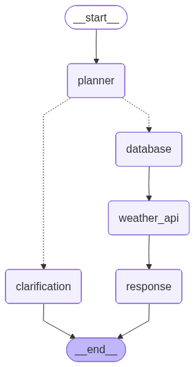
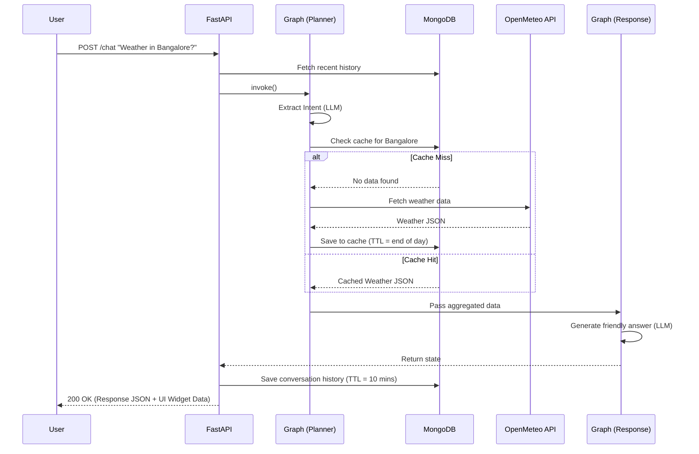
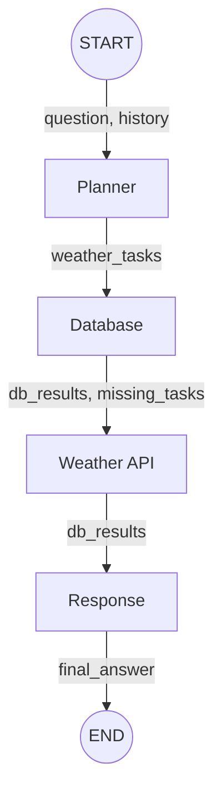
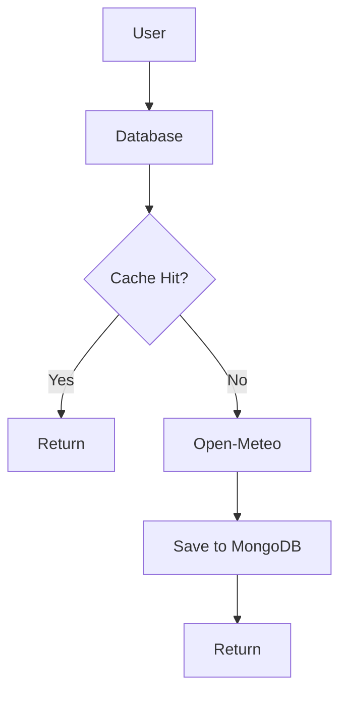
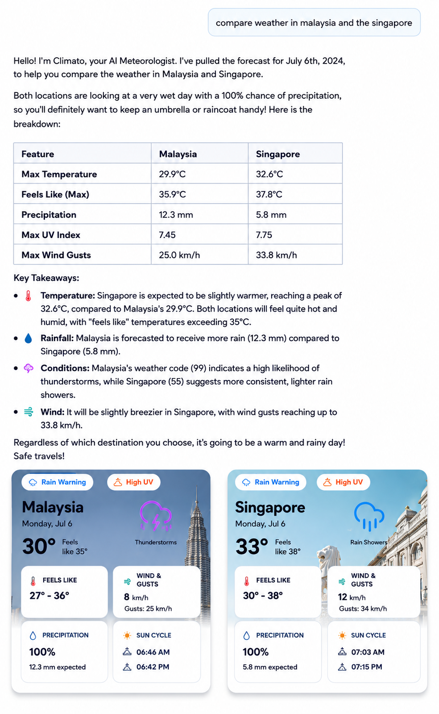

# :material-weather-partly-cloudy: Chapter 6: Climato Backend Architecture

*The Climato Weather AI Capstone.*
Tie it all together by building a complete, production-ready AI Weather Assistant application.
**Estimated Reading Time:** 45 min

---

!!! info "The Goal: Climato — A Smart Weather Assistant"
    We are building the backend for Climato — a weather application that lets users ask natural language questions about historical records and daily forecasts. 
    
    - **Completely Free:** No API keys required. We use the open-source Open-Meteo API with unlimited usage.
    - **FastAPI Part:** Exposes REST endpoints that bridge the frontend and the AI.
    - **LangGraph Part:** Powers a multi-step AI orchestration workflow (intent parsing → database cache check → external API call → natural language response generation).

---

## Step 0: Project Folder Structure

Before we dive into the code, let's understand how the backend is organized. We use a scalable, multi-tier architecture typical for modern web services.

??? example "Project Folder Structure"
    ```text
    backend/
    ├── main.py                 # Application entry point
    ├── core/                   
    │   └── database.py         # MongoDB connection setup
    ├── models/                 
    │   └── db_models.py        # Database schemas
    ├── schemas/                
    │   └── dtos.py             # Data Transfer Objects (Pydantic validation)
    ├── repositories/           
    │   └── weather_repo.py     # MongoDB queries (cache, history)
    ├── controllers/            
    │   └── chat_controller.py  # FastAPI router endpoints
    ├── tools/                  
    │   └── weather_tool.py     # Open-Meteo API integrations
    └── graph/                  
        ├── graph.py            # LangGraph workflow definition
        └── nodes.py            # LangGraph AI nodes
    ```

### Component Responsibilities

| Component | Responsibility |
|---|---|
| **FastAPI** | Receives HTTP requests |
| **LangGraph** | Controls workflow |
| **Planner Node** | Extracts weather intent |
| **Database Node** | Checks cached weather |
| **Weather Tool** | Calls Open-Meteo |
| **Repository** | Performs MongoDB queries |
| **Response Node** | Generates natural language answers |

---

## Step 1: Planning the Flow

When a user asks a question like *"What's the weather in Bangalore?"*, the request follows a strict path. We don't just blindly query an LLM; we parse the intent, check our local database cache, fetch missing data from Open-Meteo, and finally generate a response.





---

## Step 2: Foundation (Schemas & Controllers)

First, we define our **DTOs (Data Transfer Objects)** using Pydantic in `schemas/dtos.py`. These ensure every request entering the API is strictly validated.

??? example "schemas/dtos.py"
    ```python
    from pydantic import BaseModel
    from typing import Optional, List, Literal

    class WeatherTask(BaseModel):
        type: Literal["forecast", "historical"]
        city: str
        start_date: str
        end_date: str

    class ChatRequest(BaseModel):
        message: str
        session_id: str

    class ChatResponse(BaseModel):
        answer: str
        data: Optional[List[dict]] = None
    ```

Next, we expose the REST endpoint in `controllers/chat_controller.py`. This receives the request, triggers the LangGraph agent, and returns the AI's final answer.

??? example "controllers/chat_controller.py"
    ```python
    from fastapi import APIRouter
    from schemas.dtos import ChatRequest, ChatResponse
    from graph.graph import app as graph_app
    from repositories.weather_repo import insert_conversation, get_recent_conversations
    from datetime import datetime, timezone

    router = APIRouter()

    @router.post("/chat", response_model=ChatResponse)
    async def chat_endpoint(request: ChatRequest):
        # 1. Fetch recent history for this session
        history = await get_recent_conversations(request.session_id)
        
        # 2. Run LangGraph workflow
        result = await graph_app.ainvoke({
            "question": request.message,
            "history": history,
            "session_id": request.session_id
        })
        answer = result.get("final_answer", "I'm sorry, I couldn't process your request.")
        
        # 3. Save conversation with UTC datetime for MongoDB TTL index
        await insert_conversation({
            "session_id": request.session_id,
            "question": request.message,
            "answer": answer,
            "timestamp": datetime.now(timezone.utc)
        })
        
        return ChatResponse(answer=answer, data=result.get("db_results"))
    ```

---

## Why LangGraph?

You might wonder why we don't simply ask the LLM to answer the weather question directly.

The reason is that the LLM should not:
- Query databases.
- Build API URLs.
- Decide cache policies.
- Fetch external weather data.

Instead, LangGraph separates AI reasoning from deterministic execution. The LLM only understands the user's intent, while Python code performs database lookups, API requests, and caching.

This separation makes the application more reliable, faster, and easier to maintain.

---

## Step 3: Graph Construction (Nodes & State)

We use LangGraph to orchestrate our AI agent. 

### The Graph State
The state is the shared memory dictionary passed between all nodes during a single execution.



??? example "graph/state.py"
    ```python
    from typing import TypedDict

    class GraphState(TypedDict):
        session_id: str
        question: str
        history: list
        weather_tasks: list
        db_results: list
        missing_tasks: list
        final_answer: str
    ```

### The Nodes
Each node performs a specific task. We compile these nodes together in `graph/graph.py`.

**1. Planner Node**  
Parses the user's messy natural language query into a clean, structured list of `WeatherTask` requirements using an LLM tool call.

??? example "Planner Node Code"
    ```python
    async def planner_node(state: GraphState):
        messages = [
            SystemMessage(content="You are a weather routing assistant..."),
            HumanMessage(content=state["question"])
        ]
        response = llm_with_tools.invoke(messages)
        
        tasks = []
        if response.tool_calls:
            for tool_call in response.tool_calls:
                tasks.append(WeatherTask(**tool_call["args"]))
                
        needs_clarification = len(tasks) == 0
        return {"weather_tasks": tasks, "needs_clarification": needs_clarification}
    ```

**2. Clarification Node**  
If the Planner Node finds the query too ambiguous (e.g., just saying "weather"), this node safely halts execution and asks the user for missing details.

??? example "Clarification Node Code"
    ```python
    async def clarification_node(state: GraphState):
        return {"final_answer": "Which city would you like to check? Please provide the location."}
    ```

**3. Database Node (Theory)**  
This node is responsible for checking our local MongoDB cache to see if we already fetched the requested weather data today. 
- It fetches the planned tasks from the database. 
- If results are zero (cache miss), it marks the tasks as `missing_tasks` to be fetched from the external API. 
- Otherwise, it waits for parallel tasks to finish and passes the aggregated results down the line. *(We will write the actual code for this in Step 4).*

---

## Step 4: Repositories & Database Node Implementation

Now we write our database logic in `repositories/weather_repo.py` to check for cached weather.



??? example "repositories/weather_repo.py"
    ```python
    async def get_daily_weather(location_id: str, start_date: str, end_date: str) -> list[dict]:
        """
        Returns all non-stale weather_daily docs for this location_id in the given date range.
        """
        dates   = _date_range(start_date, end_date)
        now_iso = _now_iso()
        
        cursor = weather_daily_col.find({
            "location_id": location_id,
            "date":        {"$in": dates},
            "expires_at":  {"$gt": now_iso},
        })
        
        docs = await cursor.to_list(length=500)
        for doc in docs:
            doc["_id"] = str(doc["_id"])
            
        return docs
    ```

Now we can implement the **Database Node** properly. It acts as the traffic controller: fetching from the repo, and only requesting new API calls if the data is completely missing!

??? example "Database Node Code"
    ```python
    async def database_node(state: GraphState):
        tasks = state.get("weather_tasks", [])
        db_results = []
        missing_tasks = []

        for t in tasks:
            # Hit the repository logic
            hits = await get_daily_weather(loc_id, t["start_date"], t["end_date"])
            if not hits:
                missing_tasks.append(t)
            else:
                db_results.extend(hits)
                
        return {"db_results": db_results, "missing_tasks": missing_tasks}
    ```

---

## Step 5: Weather Tools

We need a dedicated tool to fetch real-world data without using any paid APIs. In `tools/weather_tool.py`, we build a wrapper around the **Open-Meteo API**.

!!! info "Why Open-Meteo?"
    We use Open-Meteo because it is:
    
    - Completely free.
    - Requires no API keys.
    - Supports forecast and historical weather.
    - Includes geocoding.
    - Well suited for educational and open-source projects.

To ensure high performance, we use **batch requests** (`asyncio.gather`). This allows us to fetch data for multiple cities and dates simultaneously, rather than waiting for each API call to finish one by one.

??? example "tools/weather_tool.py"
    ```python
    import httpx
    import asyncio

    async def fetch_weather_batch(tasks: list, client: httpx.AsyncClient) -> list[dict]:
        """One geocoding lookup per unique city, one API call per city+range group."""
        
        # 1. Geocoding pass: check local DB, fall back to API
        unique_cities = {t.city for t in tasks}
        location_map = {}
        for req_city in unique_cities:
            loc = await get_location(req_city)
            location_map[req_city.lower()] = loc

        # 2. Build requests
        reqs = []
        for task in tasks:
            loc = location_map[task.city.lower()]
            reqs.append(build_weather_request(task, loc))

        # 3. Fire all requests simultaneously using asyncio.gather
        results = []
        coros = [fetch_open_meteo(r, location_map[r.city.lower()]["id"], client) for r in reqs]
        api_results = await asyncio.gather(*coros)

        for res in api_results:
            results.extend(res)
            
        return results
    ```

---

## Step 6: Conversation History Management

To make the AI feel like a real conversation, it needs to remember what you just said. 

We use **MongoDB TTL (Time-To-Live) Indexes**. Every time a message is saved, MongoDB automatically deletes it after 10 minutes (`expireAfterSeconds=600`). In the `chat_controller.py`, we fetch these temporary messages using the user's `session_id` and pass them into the LangGraph state.

??? example "History Injection"
    ```python
    async def get_recent_conversations(session_id: str):
        cursor = conversations_collection.find({"session_id": session_id}).sort("timestamp", 1)
        return await cursor.to_list(length=5)
    ```

---

## Step 7: LLM Response

Finally, the **Response Node** takes all the aggregated `db_results` and the `history`, and feeds it into the LLM to generate a markdown-formatted, friendly response for the user.

??? example "Response Node Code"
    ```python
    async def response_node(state: GraphState):
        db_results = state.get("db_results", [])
        
        prompt = f"""You are Climato, a friendly weather AI.
        Provide a friendly markdown response based on this data: {db_results}
        """
        
        response = llm.invoke([
            SystemMessage(content=prompt),
            HumanMessage(content=state["question"])
        ])
        
        return {"final_answer": response.content}
    ```

---

## Step 8: Watch It Run (The Logs)

If we start our backend server and ask a complex multi-part question like *"differences in weather of sydney today and weather on 1999 dec 31"*, we can watch LangGraph work its magic right in the terminal console. Notice how it seamlessly splits the query into multiple tasks and navigates through the nodes:

```text
Reached Planner Node
planner has planned these tasks  to solve the query : "differences in weather of sydney today and weather on 1999 dec 31"
task 1:
{
  "type": "forecast",
  "city": "Sydney",
  "start_date": "2026-07-06",
  "end_date": "2026-07-06"
}
task 2:
{
  "type": "historical",
  "city": "Sydney",
  "start_date": "1999-12-31",
  "end_date": "1999-12-31"
}

task 1 reached DatabaseNode
found results - 0 make a weather tool call

task 2 reached DatabaseNode
found results - 0 make a weather tool call

task 1 Reached weather tool

task 2 Reached weather tool

--- [Response Node] --- Final Answer generated successfully.
```

If we immediately ask the same question again, watch what happens to the Database Node—it hits the cache and completely skips the Weather API Node!

```text
Reached Planner Node
planner has planned these tasks  to solve the query : "differences in weather of sydney today and weather on 1999 dec 31"
task 1:
{
  "type": "forecast",
  "city": "Sydney",
  "start_date": "2026-07-06",
  "end_date": "2026-07-06"
}
task 2:
{
  "type": "historical",
  "city": "Sydney",
  "start_date": "1999-12-31",
  "end_date": "1999-12-31"
}

task 1 reached DatabaseNode
found results - 1

task 2 reached DatabaseNode
found results - 1

--- [Response Node] --- Final Answer generated successfully.
```

---

## The Final Visuals

When integrated with the frontend, the UI receives both the markdown string (for the chat bubble) and the raw JSON data (to render beautiful horizontal weather widgets!).



---

## Source Code

The full, working code for this project is available on GitHub!

[**View the Climato Repository**](https://github.com/bunny/Climato)
