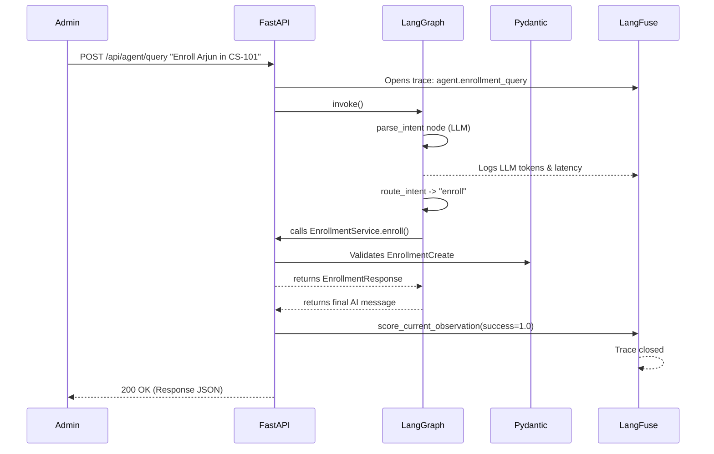

# 🎓 Chapter 6: EduTrack Project

*The EduTrack Capstone.*
Tie it all together by building a complete, production-ready Student Management AI application.
**Estimated Reading Time:** 45 min

---

> **🏫 The Story: EduTrack — A School Management System**
>
> We are building EduTrack — a backend system for a school that manages Students, Courses, and Enrollments. Every section of this chapter tells the next part of the same story, using the same data, the same IDs, the same names.
> The four technologies work together like this:
> Pydantic — validates all data going in and out (the gatekeeper)
> FastAPI — exposes the REST endpoints teachers & admins call
> LangGraph — powers an AI assistant that handles enrollment queries via natural language
> LangFuse — observes every operation: API call, AI decision, DB write — fully traceable

**Pydantic — Validates data → FastAPI — Exposes REST API → LangGraph — AI orchestration → LangFuse — Observability**

## 1. Project Structure — EduTrack School System

EduTrack manages three resources: Students, Courses, and Enrollments. Each resource has its own file per layer. The folder structure below is the same whether you're using Spring Boot or FastAPI — only the filenames and annotations differ.

??? abstract "Folder Structure Comparison"
    | FastAPI File | Spring Boot Equivalent |
    |---|---|
    | `models/student.py`  (SQLAlchemy ORM) | `Student.java`  (@Entity) |
    | `schemas/student_schema.py`  (Pydantic) | `StudentDTO.java` |
    | `services/student_service.py` | `StudentService.java`  (@Service) |
    | `routes/students.py` | `StudentController.java`  (@RestController) |
    | `agent/enrollment_agent.py` | (LangGraph AI agent — no Spring equivalent) |
    | `main.py` | `Application.java`  (@SpringBootApplication) |

---

### Step 1 of 4 · Pydantic — Define & Validate All Data

Before writing a single route or database query, we define all our data shapes with Pydantic. These models are the single source of truth.

!!! note "The Gatekeeper"
    Every field in these models is used consistently across all four technologies. The same `StudentCreate` model that validates the HTTP POST body is also what the LangGraph agent outputs.

#### StudentCreate

**Purpose**
Represents the request body for creating a new student. Validates email formats and grade constraints.

**Used In**
- FastAPI `POST /students`
- LangGraph `enroll_node`

```python
class StudentCreate(BaseModel):
    name: str = Field(min_length=2, max_length=100)
    email: EmailStr
    roll_number: str = Field(pattern=r"^STU-\d{4}$")
    grade: int = Field(ge=1, le=12)
```

#### StudentUpdate

**Purpose**
Represents a partial edit (PATCH). All fields are optional.

**Used In**
- FastAPI `PATCH /students/{id}`

```python
class StudentUpdate(BaseModel):
    name: Optional[str] = Field(None, min_length=2, max_length=100)
    grade: Optional[int] = Field(None, ge=1, le=12)
```

#### StudentResponse

**Purpose**
The final output sent back to the client. Safely strips internal data.

**Used In**
- All FastAPI `GET` endpoints
- LangGraph agent final output

```python
class StudentResponse(BaseModel):
    id: int
    name: str
    email: str
    roll_number: str
    grade: int
    enrolled_at: datetime
    model_config = {"from_attributes": True}
```

!!! tip "Key Takeaways"
    - **Pydantic replaces DTOs + Bean Validation** in a single class.
    - **Separate your Request and Response models** to avoid accidentally exposing sensitive data.
    - **Use `from_attributes = True`** so Pydantic can read directly from SQLAlchemy ORM objects.

??? example "Complete schemas/student_schema.py"
    ```python
    from pydantic import BaseModel, Field, EmailStr
    from typing import Optional
    from datetime import datetime

    class StudentCreate(BaseModel):
        name: str = Field(min_length=2, max_length=100)
        email: EmailStr
        roll_number: str = Field(pattern=r"^STU-\d{4}$")
        grade: int = Field(ge=1, le=12)

    class StudentUpdate(BaseModel):
        name: Optional[str] = Field(None, min_length=2, max_length=100)
        grade: Optional[int] = Field(None, ge=1, le=12)

    class StudentResponse(BaseModel):
        id: int
        name: str
        email: str
        roll_number: str
        grade: int
        enrolled_at: datetime
        model_config = {"from_attributes": True}
    ```

---

### Step 2 of 4 · FastAPI — Expose the REST Endpoints

Now that our data shapes are locked down, we wire them into FastAPI routes. FastAPI reads the schema, validates input, and serializes output automatically.

#### Create

**Purpose**
Registers a new student into the database.

**Used In**
- Admin Dashboard

```python
@router.post("/", response_model=StudentResponse, status_code=201)
async def create_student(data: StudentCreate, svc = Depends(get_svc)):
    return svc.create(data)
```

#### Read

**Purpose**
Fetches paginated students or a specific student by ID.

```python
@router.get("/", response_model=List[StudentResponse])
async def list_students(skip: int = 0, limit: int = 20, svc = Depends(get_svc)):
    return svc.get_all(skip=skip, limit=limit)
```

#### Update & Delete

**Purpose**
Modifies existing records or drops them (cascading to enrollments).

```python
@router.patch("/{student_id}", response_model=StudentResponse)
async def update_student(student_id: int, data: StudentUpdate, svc = Depends(get_svc)):
    return svc.update(student_id, data)

@router.delete("/{student_id}", status_code=204)
async def delete_student(student_id: int, svc = Depends(get_svc)):
    svc.delete(student_id)
```

!!! tip "Key Takeaways"
    - **FastAPI replaces `@RestController`**.
    - **`response_model` handles serialization automatically** (no `ObjectMapper` needed).
    - **`Depends()` replaces `@Autowired`** for injecting the Service layer.

??? example "Complete routes/students.py"
    ```python
    from fastapi import APIRouter, Depends, status
    from sqlalchemy.orm import Session
    from database import get_db
    from schemas.student_schema import StudentCreate, StudentUpdate, StudentResponse
    from services.student_service import StudentService
    from typing import List

    router = APIRouter(prefix="/api/students", tags=["Students"])

    def get_svc(db: Session = Depends(get_db)): return StudentService(db)

    @router.post("/", response_model=StudentResponse, status_code=201)
    async def create_student(data: StudentCreate, svc = Depends(get_svc)):
        return svc.create(data)

    @router.get("/", response_model=List[StudentResponse])
    async def list_students(skip:int=0, limit:int=20, svc=Depends(get_svc)):
        return svc.get_all(skip=skip, limit=limit)

    @router.get("/{student_id}", response_model=StudentResponse)
    async def get_student(student_id: int, svc=Depends(get_svc)):
        return svc.get_or_404(student_id)

    @router.patch("/{student_id}", response_model=StudentResponse)
    async def update_student(student_id:int, data:StudentUpdate, svc=Depends(get_svc)):
        return svc.update(student_id, data)

    @router.delete("/{student_id}", status_code=204)
    async def delete_student(student_id: int, svc=Depends(get_svc)):
        svc.delete(student_id)
    ```

---

### Step 3 of 4 · LangGraph — AI Enrollment Assistant

The school principal wants a natural-language assistant: *"Enroll Arjun in CS-101"*. Instead of making the admin click buttons, LangGraph orchestrates the AI to hit the exact same FastAPI services we built in Step 2.

#### State

**Purpose**
The `TypedDict` that carries data between graph nodes. Think of it as the shared memory for one specific execution of the agent.

```python
class SchoolAgentState(TypedDict):
    user_query: str          # "Enroll Arjun in CS-101"
    intent: str              # "enroll" | "list_students" | "drop"
    student_name: str        
    course_code: str         
    result: dict             
```

#### Nodes

**Purpose**
Python functions that update the `State`. This specific node uses the LLM to extract the user's intent.

```python
def parse_intent(state: SchoolAgentState) -> dict:
    prompt = f"Parse the admin query: {state['user_query']} into JSON."
    response = llm.invoke([HumanMessage(content=prompt)])
    parsed = json.loads(response.content)
    return {"intent": parsed["intent"], "student_name": parsed.get("student_name")}
```

#### Router

**Purpose**
A simple function that looks at the current `State` and decides which Node executes next.

```python
def route_intent(state: SchoolAgentState) -> str:
    intent_map = {"enroll": "enroll", "drop": "drop"}
    return intent_map.get(state["intent"], END)
```

#### Graph Construction

**Purpose**
Wiring the Nodes and Routers together into a compiled StateMachine.

```python
g = StateGraph(SchoolAgentState)
g.add_node("parse_intent", parse_intent)
g.add_node("enroll", enroll_node)
g.add_node("drop", drop_node)

g.set_entry_point("parse_intent")
g.add_conditional_edges("parse_intent", route_intent)
school_agent = g.compile()
```

!!! tip "Key Takeaways"
    - **LangGraph separates AI logic from Business Logic**. The AI just extracts parameters; it calls the existing `StudentService` to do the actual database writes.
    - **State is immutable**. Each node returns a partial dictionary that merges into the global state.

??? example "Complete agent/enrollment_agent.py"
    ```python
    from typing import TypedDict, Literal
    from langgraph.graph import StateGraph, END
    from langchain_openai import ChatOpenAI
    from langchain_core.messages import HumanMessage
    from schemas.enrollment_schema import EnrollmentCreate
    from services.enrollment_service import EnrollmentService

    class SchoolAgentState(TypedDict):
        user_query: str
        intent: str
        student_name: str
        course_code: str
        student: dict | None
        result: dict
        error: str | None

    llm = ChatOpenAI(model="gpt-4o-mini", temperature=0)

    def parse_intent(state: SchoolAgentState) -> dict:
        prompt = f'''Parse query: "{state["user_query"]}" into JSON {"intent", "student_name", "course_code"}'''
        response = llm.invoke([HumanMessage(content=prompt)])
        import json
        parsed = json.loads(response.content)
        return {"intent": parsed["intent"], "student_name": parsed.get("student_name", ""), "course_code": parsed.get("course_code", "")}

    def enroll_node(state: SchoolAgentState, db) -> dict:
        # Calls the FastAPI Service layer
        result = EnrollmentService(db).enroll(EnrollmentCreate(student_id=state["student"]["id"], course_id=7))
        return {"result": result.model_dump()}

    def route_intent(state: SchoolAgentState) -> str:
        intent_map = {"enroll": "enroll", "drop": "drop", "list_students": "list_students"}
        return intent_map.get(state["intent"], END)

    g = StateGraph(SchoolAgentState)
    g.add_node("parse_intent", parse_intent)
    g.add_node("enroll", enroll_node)
    
    g.set_entry_point("parse_intent")
    g.add_conditional_edges("parse_intent", route_intent, {"enroll": "enroll"})
    school_agent = g.compile()
    ```

---

### Step 4 of 4 · LangFuse — Observe Every Operation End-to-End

We add full observability. LangFuse traces the complete lifecycle: the FastAPI request, the LangGraph agent's decisions, the LLM call, and the DB write — all visible in one trace tree.

#### Tracing & Metadata

**Purpose**
Use the `@observe` decorator to automatically capture inputs, outputs, and execution time. We inject business metadata (like `student_id`) so we can easily search for it later in the dashboard.

```python
from langfuse.decorators import observe, langfuse_context

@observe(name="fastapi.enroll_student")
def traced_enroll(data: EnrollmentCreate, db) -> dict:
    langfuse_context.update_current_trace(
        tags=["crud", "enrollment"],
        metadata={"student_id": data.student_id, "course_id": data.course_id}
    )
    result = EnrollmentService(db).enroll(data)
    langfuse_context.score_current_observation(name="success", value=1.0)
    return result.model_dump()
```

!!! tip "Key Takeaways"
    - **`@observe` replaces manual logging or MDC contexts**.
    - **Attach business IDs as metadata** so you can track a single user across both REST endpoints and AI Agent invocations.

??? example "Complete agent/observed_agent.py"
    ```python
    from langfuse.decorators import observe, langfuse_context
    from langfuse.callback import CallbackHandler
    from schemas.enrollment_schema import EnrollmentCreate

    @observe(name="fastapi.enroll_student")
    def traced_enroll(data: EnrollmentCreate, db) -> dict:
        langfuse_context.update_current_trace(
            tags=["crud", "enrollment", "create"],
            metadata={
                "student_id": data.student_id,
                "course_id": data.course_id,
                "resource": "enrollment"
            }
        )
        result = EnrollmentService(db).enroll(data)
        langfuse_context.score_current_observation(name="success", value=1.0)
        return result.model_dump()

    @observe(name="agent.enrollment_query")
    def run_school_agent(query: str, db) -> dict:
        langfuse_context.update_current_trace(
            tags=["ai", "langgraph"],
            metadata={"query": query}
        )
        langfuse_handler = CallbackHandler(session_id="admin-session-001")
        config = {"callbacks": [langfuse_handler]}

        result = school_agent.invoke({"user_query": query}, config=config)
        return result
    ```

---

## 2. Putting It All Together — End-to-End Flow

Here is the complete journey of a single natural-language enrollment request — *"Enroll Arjun in CS-101"* — flowing through all four technologies simultaneously:



!!! note "The Big Picture"
    The same `student_id=42` and `course_id=7` appear in every step. LangFuse, LangGraph, FastAPI, and Pydantic are all working on the same piece of data — just handling different concerns: AI reasoning, HTTP transport, business validation, and observability.

---

## 3. Final Annotation Mapping

| Spring Boot | FastAPI / Python |
|---|---|
| `@SpringBootApplication` | `FastAPI()` + `uvicorn main:app --reload` |
| `@RestController` + `@RequestMapping` | `APIRouter(prefix=...)` + `@router.get/post...` |
| `@RequestBody @Valid DTO` | Pydantic model as fn param (auto-validated) |
| `@Service` | Service class injected via `Depends()` |
| `@Repository` / `JpaRepository` | SQLAlchemy ORM + Repository class |
| `@Entity` + `@Column` | SQLAlchemy Column definitions |
| `@Valid` + Bean Validation | Pydantic Field validators |
| Micrometer + Actuator | LangFuse traces + `@observe` decorator |
| Spring State Machine | LangGraph StateGraph + nodes + edges |

---

## 4. SQLAlchemy vs Hibernate: The Critical Missing Links

If you look closely at the database code above, it works perfectly, but there are a few massive "Java-to-Python" pitfalls hidden in the implementation.

### Database Migrations (Alembic)

In Spring Boot, you add `spring.jpa.hibernate.ddl-auto=update` and your tables magically appear. **SQLAlchemy does not do this automatically.**

You have two choices:
1. **The Quick Prototype Way:** Add `Base.metadata.create_all(bind=engine)` when your app starts.
2. **The Production Way (Alembic):** Alembic is the exact equivalent of **Flyway** or **Liquibase**. 

### The Sync vs Async Event Loop Mismatch (Performance Bug!)

As we covered in detail in **[Chapter 0: Async/Await](../chapter-0/index.md#8-asyncawait-critical-for-fastapi)** and **[Chapter 3: FastAPI](../chapter-3/index.md)**, there is a critical difference in how Python and Java handle blocking code.

Notice that our FastAPI routes are `async def`, but our database `Session` is synchronous. 
If you put a blocking database query inside an `async def` function, **it blocks the entire server event loop**. (Spring's blocking JDBC model doesn't have this exact problem because it uses a thread-per-request model).

To fix this for high-traffic apps, you must use **AsyncSQLAlchemy** (`AsyncSession`) and an async driver like `asyncpg`.

### Transaction Boundaries (@Transactional)

Unlike Spring Boot, which magically handles transaction rollbacks via the `@Transactional` annotation (discussed in our earlier architectural comparisons), SQLAlchemy requires explicit boundary management.

You must handle the `commit()` and `rollback()` boundaries yourself in the Service layer.

```python
def enroll(self, data: EnrollmentCreate):
    try:
        enrollment = Enrollment(...)
        self.db.add(enrollment)
        self.db.commit()  # <-- You must call commit!
    except Exception as e:
        self.db.rollback() # <-- Catch and rollback!
        raise
```
